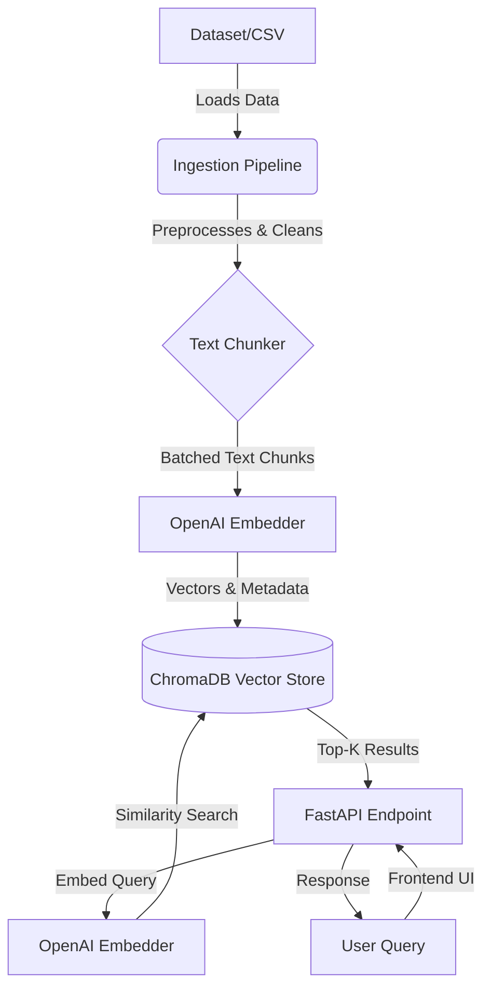

# Retrieval augmented generation RAG 🚀


A modular, production-grade Retrieval-Augmented Generation (RAG) pipeline and web application. The system ingests documents, processes and embeds text using OpenAI's models, stores them in a local ChromaDB vector store, and provides a FastAPI backend coupled with a simple HTML/JavaScript frontend to perform semantic searches.

## 🌟 Key Features

- **Scalable Batch Ingestion:** Process massive datasets without size limitations. Documents are processed and embedded in manageable batches, keeping memory usage low.
- **Advanced Text Preprocessing:** Includes customizable strict cleaning and formatting to ensure high-quality vector embeddings.
- **FastAPI Backend:** High-performance RESTful APIs to handle ingestion and query retrieval.
- **ChromaDB Vector Store:** Efficient, persistent local vector database for storing chunks and metadata.
- **OpenAI Embeddings:** Leverages state-of-the-art embedding models to accurately represent semantic meaning.
- **Centralized Configuration:** Easy-to-tune parameters for chunk sizing, overlap, dataset selection, and tokenizer logic (`config.py`).
- **Interactive UI:** A lightweight vanilla frontend for immediate querying and visualization of retrieved contexts and their similarity scores.

## 🏗️ Architecture



## 📂 Project Structure

```text
.
├── backend/
│   ├── app/                # FastAPI application, endpoints, and main server
│   ├── chroma_db/          # Persistent local storage for the Chroma vector database
│   ├── config/             # Centralized configuration (chunk size, overlap, thresholds)
│   ├── core/               # Core business logic (embedding, vector store operations)
│   ├── datasets/           # Directory containing source CSVs/documents
│   ├── ingestion/          # Data ingestion pipeline (loaders, preprocessors, batching)
│   ├── requirements.txt    # Python dependencies
│   └── .env.example        # Example environment variables
└── frontend/
    └── index.html          # Lightweight interactive web UI
```

## 🚀 Setup & Installation

Follow these steps to set up the project locally:

### 1. Configure Environment Variables

Navigate to the `backend` directory, copy the `.env.example` file to create a `.env` file, and fill in your credentials.

```bash
cd backend
cp .env.example .env
```

Ensure your `.env` contains your API key:

```env
OPENAI_API_KEY="your_openai_api_key_here"
```

### 2. Install Dependencies

It is highly recommended to use a virtual environment. Install the necessary Python packages:

```bash
pip install -r requirements.txt
```

### 3. Run the Backend Server

With the new modular structure, `main.py` is located inside the `app` folder. From the `backend` directory, start the FastAPI server using Uvicorn:

```bash
uvicorn app.main:app --reload
```

The API will now be running at `http://127.0.0.1:8000`.

### 4. Access the Frontend

Open the `frontend/index.html` file in your preferred web browser. You can immediately begin submitting queries to test the RAG pipeline's retrieval capabilities.

## ⚙️ Configuration (`backend/config/config.py`)

You can fine-tune the behavior of the RAG pipeline by modifying the following parameters in `backend/config/config.py`:

- `chunk_size`: Max token size for each text chunk.
- `chunk_overlap`: Number of overlapping tokens between consecutive chunks.
- `batch_threshold`: Number of chunks to process simultaneously (prevents large CSV bottlenecking).
- `dataset_name`: The default dataset file to load.
- `top_k`: How many results to return for a semantic query.
- `similarity_threshold`: Minimum score to consider a chunk relevant.
- `STRICT_CLEANING`: Toggle for aggressive text cleaning before embedding.
